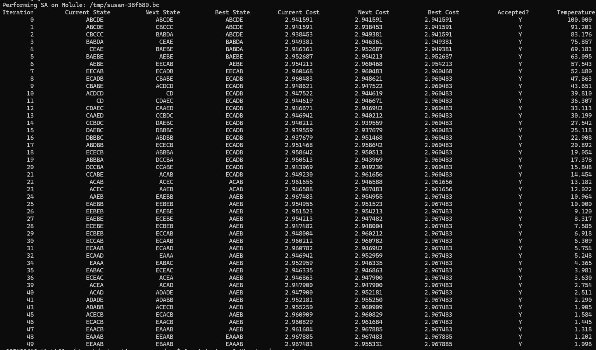

# Protean Compiler Framework

[](https://github.com/llvm/llvm-project/releases/tag/llvmorg-19.1.7)

Welcome to the Protean Compiler project!

This repository contains the source code for Protean, a C/C++ compiler based
on [LLVM 19.x](https://github.com/llvm/llvm-project/tree/release/19.x) with
ML-guided phase ordering capabilities.

Protean's ML model, a.k.a. `IR2Score`, can leverage either our own handcrafted
static features, i.e. `Protean Feature Set (PFS)`, defined in
 `llvm/include/llvm/Analysis/ProteanCollectFeatures.h`, or
[IR2Vec](https://github.com/IITH-Compilers/IR2Vec.git) embeddings. Users can
decide which version of the model to use by passing a command-line option when
compiling their projects with Protean:

```
-Wprotean,-use-protean-collect=false // Use IR2Score trained w/ IR2VEC
-Wprotean,-use-protean-collect=true  // Use IR2Score trained w/ PFS
```

## Build Instuctions

[IR2Vec](https://github.com/IITH-Compilers/IR2Vec) is a submodule in this repository, so you will need to initialize the submodule before building LLVM:

```sh
git submodule update --init --recursive
```

Once the submodule is also checked out, [build LLVM](README-llvm.md) as you
normally would with CMake, however, there are a few additional flags to enable Protean's models for IR2Score, i.e., IR2Score w/ IR2VEC Features or IR2Score w/ Protean Features, both of which you can add to be built with LLVM (AOT). We have already provided both precompiled models to both for `X86` and `AARCH64` achitectures under `acpo/overrride`. Refer to [this ACPOModel Deployment README](https://github.com/BiSheng-Compiler-Agents/ACPO/blob/master/README.md#deploying-an-acpomodel-with-llvm) for further instructions on how to generate your own Precompiled models from a Tensorflow's frozen model (`.pb`) file. 

For example, build both IR2Score models for an `AARCH64` target (defind with `-DLLVM_ACPO_OVERRIDE_ARCH`) with LLVM:

```sh
mkdir build

// PATH to your Tensorflow package (tested with Python 3.9 and 3.10)
export TENSORFLOW_AOT_PATH="/PATH/TO/lib/python3.XXX/site-packages/tensorflow"

// PATH to the ACPO folder
export BISHENG_ACPO_DIR="$PWD/acpo"

cmake -S "$PWD/llvm" \
      -G Ninja \
      -B "$PWD/build" \
      -DCMAKE_BUILD_TYPE="RelWithDebInfo" \
      -DLLVM_ENABLE_ASSERTIONS=ON \
      -DLLVM_ENABLE_PROJECTS="clang;lld" \
      -DLLVM_TARGETS_TO_BUILD="AArch64;X86" \
      -DCMAKE_CXX_FLAGS="-DPROTEAN" \ 
      -DCMAKE_C_FLAGS="-DPROTEAN" \
      -DACPO_AOT=ON \
      -DTENSORFLOW_AOT_PATH="${TENSORFLOW_AOT_PATH}" \
      -DLLVM_ACPO_MODEL_NAMES="ir2scoreir2vec;ir2scoreprotean" \
      -DLLVM_ACPO_MODEL_PATHS="${BISHENG_ACPO_DIR}/models/ir2score.pb-IR2VEC;${BISHENG_ACPO_DIR}/models/ir2score.pb-Protean" \
      -DLLVM_ACPO_MODEL_SIGNATURES="serving_default;serving_default" \
      -DCMAKE_INSTALL_RPATH_USE_LINK_PATH=True \
      -DLLVM_ACPO_OVERRIDE=1 \
      -DLLVM_ACPO_OVERRIDE_PATH="${BISHENG_ACPO_DIR}/overrides" \
      -DLLVM_ACPO_OVERRIDE_ARCH="AARCH64"


// Once CMake generated the configurations, build LLVM:
cmake --build $PWD/build -j8
```


You should see these debug messages during CMake:

```sh
-- Using provided header llvm-project/build/lib/Analysis/IR2SCOREIR2VECCompiledModel.h and object /home/a00548064/llvm-project/build/lib/Analysis/IR2SCOREIR2VECCompiledModel.o
      files for model IR2SCOREIR2VECCompiledModel
...

-- Using provided header llvm-project/build/lib/Analysis/IR2SCOREPROTEANCompiledModel.h and object /home/a00548064/llvm-project/build/lib/Analysis/IR2SCOREPROTEANCompiledModel.o
      files for model IR2SCOREPROTEANCompiledModel
``` 


The build will produce the `protean` executable as `$PWD/build/bin/protean` and you should have the precompiled models copied over to `./build/lib/Analysis`. 

## Usage

Once the build is verified, you can use protean with IR2VEC feature collection technique for 20 iterations on a test example `FOO.cpp`, use:

```sh
$PWD/build/bin/clang -OP -mllvm -protean 
-Wprotean,-use-protean-collect=false,-max-iterations=10,-protean-output-table FOO.cpp
```

Protean compiler enablement is done via the addition of `-OP -mllvm -protean` to your clang command line arguments. There are many other hyperparameters defined in `Protean.cpp` (`llvm/tools/protean/protean.cpp`) which can be tuned and customized by the addition of `-Wprotean,-PARAM-1,...,PARAM-N`. Similarly, Protean can be added to any project's CMake/Make for enablement during build. 

## Tutorial Video

Here is a quick tutorial video on how to build and use Protean compiler: 

[](https://youtu.be/MIGf12nNgZM?si=71K2xb2wCQptuPXd)


## Citation

If you use any of the materials in this project, i.e. code, provided models,
methodology, etc., please cite this work published at ACM Transaction on Architecture and Code Optimization (TACO):

```
@article{ashouri2026protean,
  title={Protean compiler: An agile framework to drive fine-grain phase ordering},
  author={Ashouri, Amir H and Shirahmad Gale Bagi, Shayan and Satheeskumar, Kavin and Srikanth, Tejas and Zhao, Jonathan and Saidoun, Ibrahim and Wang, Ziwen and Chan, Bryan and Czajkowski, Tomasz S},
  journal={ACM Transactions on Architecture and Code Optimization},
  volume={23},
  number={3},
  pages={1--26},
  year={2026},
  publisher={ACM New York, NY}
}
```

This work has been accepted by [ACM TACO](https://dl.acm.org/journal/taco) in
June 2026, and is scheduled to be presented at the HiPEAC 2027 conference as
an invited paper. Details will be added here soon.
